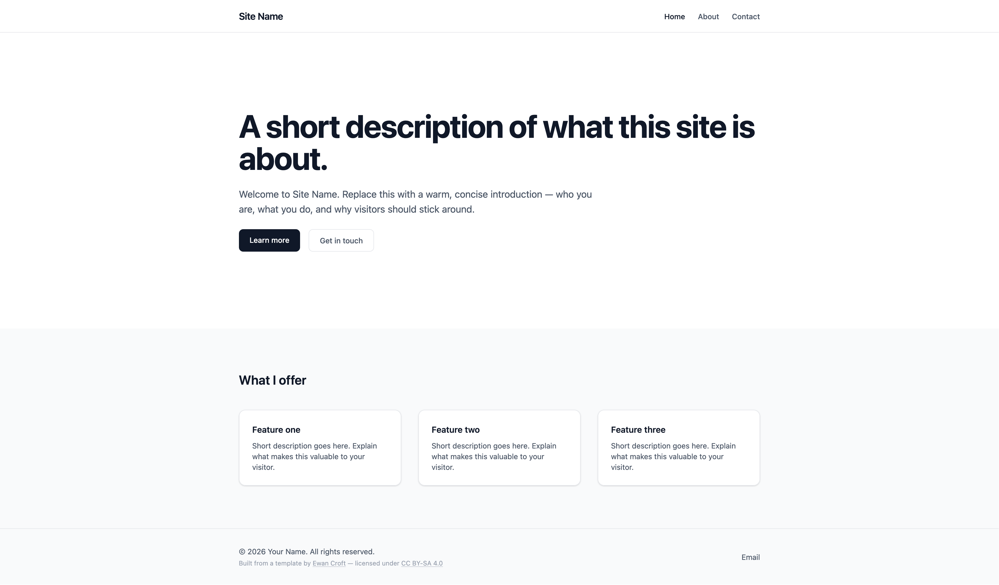
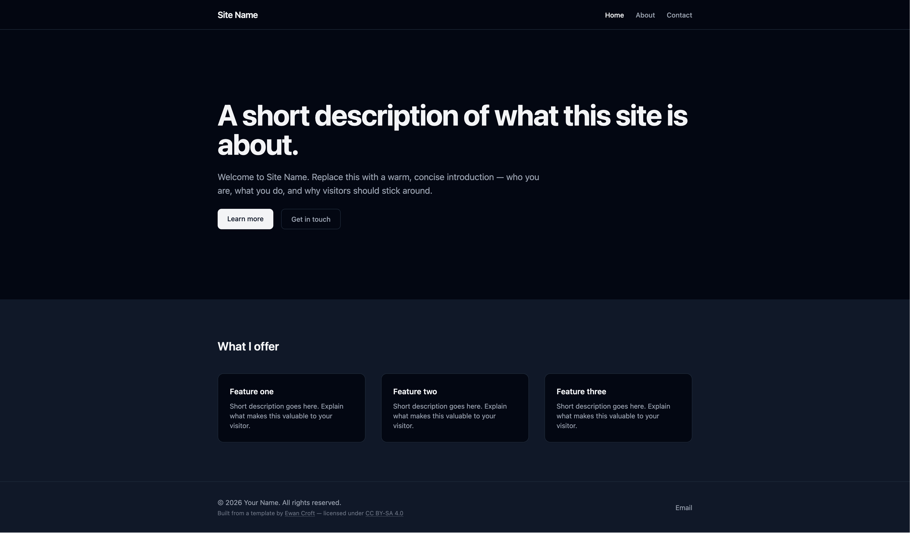

# website-comm-template

A SvelteKit + Tailwind CSS starter template for Ko-fi website commissions.

 

## Using this template

For client setup instructions, see **[SETUP.md](./SETUP.md)**.

## Project structure

```
src/
  lib/
    components/
      Nav.svelte      ← sticky top nav, mobile-responsive
      Footer.svelte   ← copyright + social links
    config.ts         ← ✏️  edit this first for every commission
    email.ts          ← contact form email sender (swap provider here)
    index.ts
  routes/
    +layout.svelte    ← wraps all pages with Nav + Footer
    +page.svelte      ← homepage
    layout.css        ← Tailwind entry point
    about/
      +page.svelte
    contact/
      +page.svelte
static/               ← put images, fonts, etc. here
```

## Adding a new page

1. Create a folder under `src/routes/`, e.g. `src/routes/portfolio/`
2. Add a `+page.svelte` file inside it
3. Add a matching entry to `navLinks` in `src/lib/config.ts`

## Recreate from scratch

```sh
pnpm dlx sv@0.12.5 create --template minimal --types ts \  
  --add prettier tailwindcss="plugins:typography,forms" \
  sveltekit-adapter="adapter:auto" \
  --install pnpm ./
```

## Licence

Copyright © Ewan Croft (<https://ewancroft.uk>)  
Licensed under [CC BY-SA 4.0](https://creativecommons.org/licenses/by-sa/4.0/).

You are free to use, adapt, and redistribute this template — including for commercial commissions — provided you give appropriate credit to Ewan Croft, link to the licence, and distribute any derivative work under the same licence. The attribution notice in `Footer.svelte` satisfies this requirement for deployed sites.
